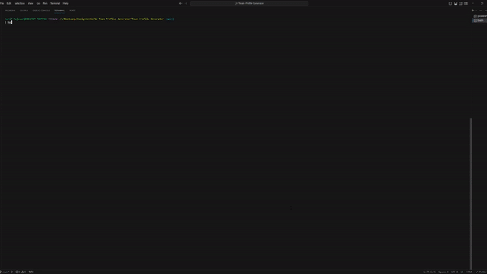
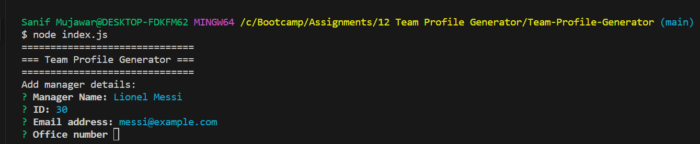
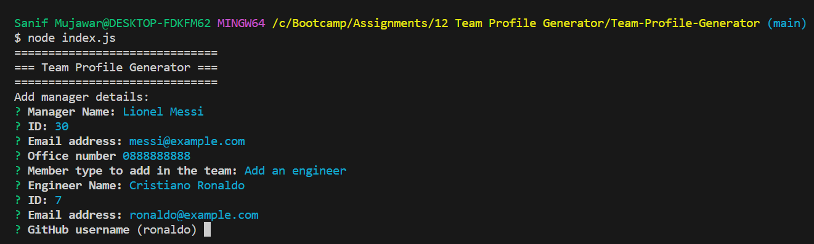
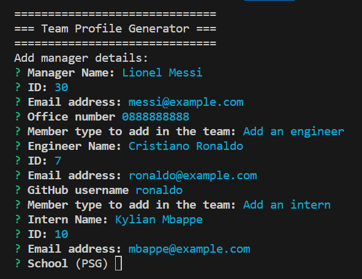
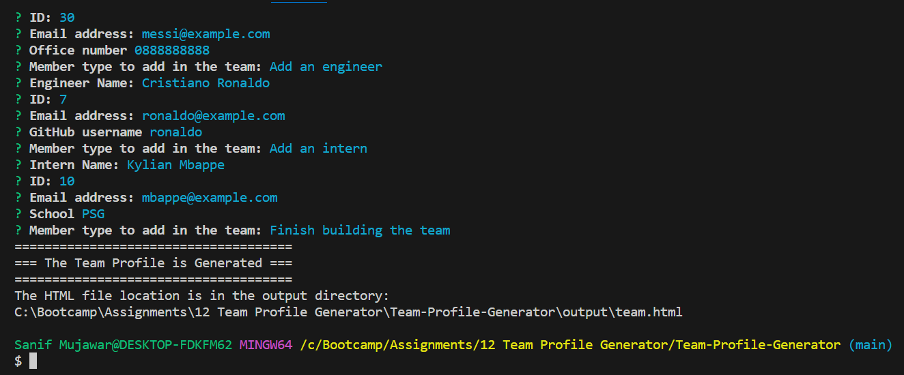

# 👥 Team Profile Generator

## 🔨 Task

To create a Node.js command-line application that allows a user to enter information on their development team and returns a webpage with the information they entered dynamically added. This project utilizes the [Inquirer](https://github.com/SBoudrias/Inquirer.js#readme) package to prompt the user, including input validation and question sets dependent on the users answers. It also uses ES6 classes to create objects based off the information entered.

This application is complete with testing by the [Jest](https://jestjs.io/docs/getting-started) package.

## 📎 How to Use

Make a directory on your computer and clone this repository into it. In the terminal for the project directory, run `npm install` to download the Inquirer and Jest packages.

Once you are ready to run the program, enter `npm start` in the terminal, and answer the on-screen questions. Once you end the program, wait to see if you received a confirmation message declaring that your webpage is ready. If so, navigate to the `/dist` folder where you will find an `index.html` and `style.css` file. Double check that all of your information is correct, then you are done!

## 🔍 Preview



## 📷 Screenshots

1. Initialize the application with `npm test`:


2. Initializing the application immediately prompts with information for the Manager, then prompts for what to do next:



3. Selecting 'Engineer' gives a series of prompts specific to the engineer:



4. Selecting 'Intern' is the same, you receive specific prompts for an intern:



5. Receiving confirmation of no errors and webpage being made:



6. Preview of generated file:


## User Story

```md
AS A manager
I WANT to generate a webpage that displays my team's basic info
SO THAT I have quick access to their emails and GitHub profiles
```

## Acceptance Criteria

```md
GIVEN a command-line application that accepts user input
WHEN I am prompted for my team members and their information
THEN an HTML file is generated that displays a nicely formatted team roster based on user input
WHEN I click on an email address in the HTML
THEN my default email program opens and populates the TO field of the email with the address
WHEN I click on the GitHub username
THEN that GitHub profile opens in a new tab
WHEN I start the application
THEN I am prompted to enter the team manager’s name, employee ID, email address, and office number
WHEN I enter the team manager’s name, employee ID, email address, and office number
THEN I am presented with a menu with the option to add an engineer or an intern or to finish building my team
WHEN I select the engineer option
THEN I am prompted to enter the engineer’s name, ID, email, and GitHub username, and I am taken back to the menu
WHEN I select the intern option
THEN I am prompted to enter the intern’s name, ID, email, and school, and I am taken back to the menu
WHEN I decide to finish building my team
THEN I exit the application, and the HTML is generated
```

## Technical Details 🛠️

The README Generator is built using Node.js and the Inquirer.js library for user prompts. It dynamically generates README files based on user input and predefined templates.

## Repository Quality 📚

The GitHub repository for this project adheres to best practices in terms of file structure, naming conventions, class/id naming, indentation, and commit messages.

## License 📜

This project is open source and available under the MIT License. See the [LICENSE](LICENSE) file for details.

## Contact Information 📧

For questions, feedback, or contributions, please contact [Sanif Mujawar](sanifmujawar@gmail.com).

---

Feel free to enhance this README further with additional sections or details specific to your README Generator project. This template provides a solid foundation for informing users about the tool's features, how to use it, and where to find more information.
